<h1 align="center">Hi 👋, I'm Mario</h1>

<h3 align="center">Backend Engineer focused on architecture, reliability, and maintainable systems</h3>

  
  
  

  I build backend systems using PHP, Laravel, PostgreSQL, and Redis, with a strong focus on architecture, testing, performance, security, and production reliability.

  I started programming at eleven by experimenting with C and building small 2D games. Today, I work primarily on production web applications, API integrations, backend infrastructure, and developer tooling. In the longer term, I am working toward software architecture and systems engineering, with a growing interest in distributed systems and lower-level programming.

 

<h2 align="center">About me</h2>

<table align="center">
  <tr>
    <td>🔭</td>
    <td>Working on backend architecture, integrations, database design, automated testing, CI/CD, observability, and production reliability.</td>
  </tr>
  <tr>
    <td>🌱</td>
    <td>Studying software architecture, algorithms, distributed systems, Rust, C++, x86 assembly, and reverse engineering.</td>
  </tr>
  <tr>
    <td>🛠️</td>
    <td>Interested in refactoring, strong abstractions, testability, performance, security, and developer experience.</td>
  </tr>
  <tr>
    <td>💬</td>
    <td>Ask me about Laravel, PHP, PostgreSQL, backend architecture, testing, and system design.</td>
  </tr>
</table>

 

<h2 align="center">Technology stack</h2>

<h3 align="center">Backend and databases</h3>

  
  &nbsp;
  
  &nbsp;
  
  &nbsp;
  

  PHP · Laravel · PostgreSQL · Redis

<h3 align="center">Frontend</h3>

  
  &nbsp;
  
  &nbsp;
  

  Vue.js · TypeScript · Tailwind CSS

<h3 align="center">Infrastructure and tooling</h3>

  
  &nbsp;
  
  &nbsp;
  
  &nbsp;
  
  &nbsp;
  

  Azure · Linux · Git · GitHub Actions · Docker

<h3 align="center">Currently exploring</h3>

  
  &nbsp;
  
  &nbsp;
  
  &nbsp;
  

  Python · Rust · C++ · Bash · x86 assembly

 

<h2 align="center">GitHub statistics</h2>

  
  

 

  <i>Building software that remains reliable, understandable, and maintainable as it grows.</i>

